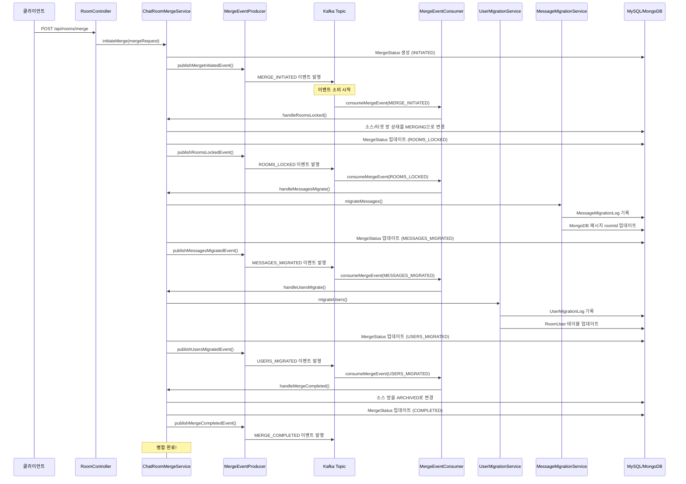
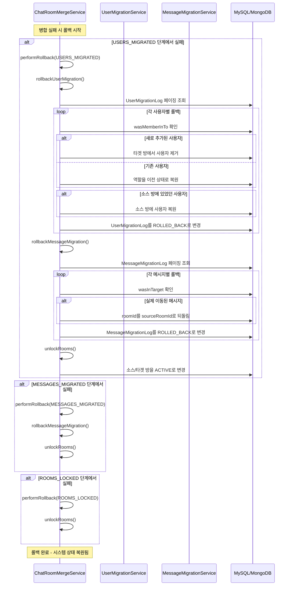
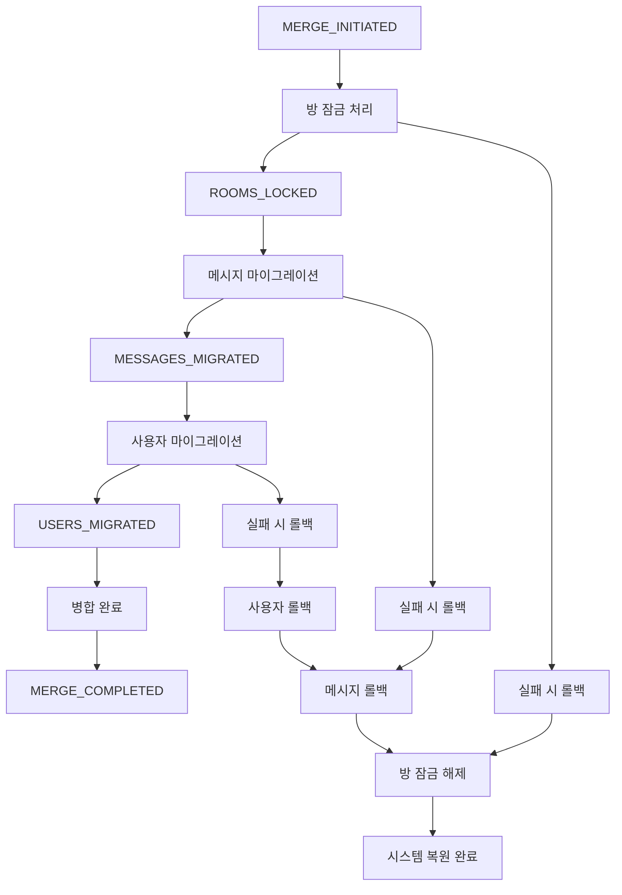
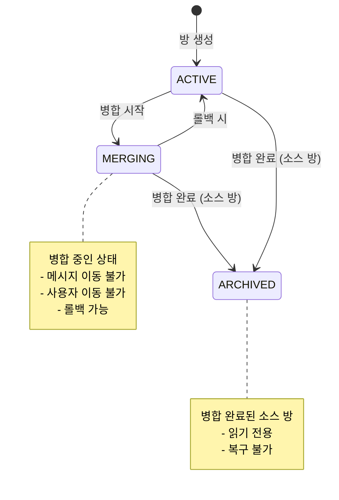
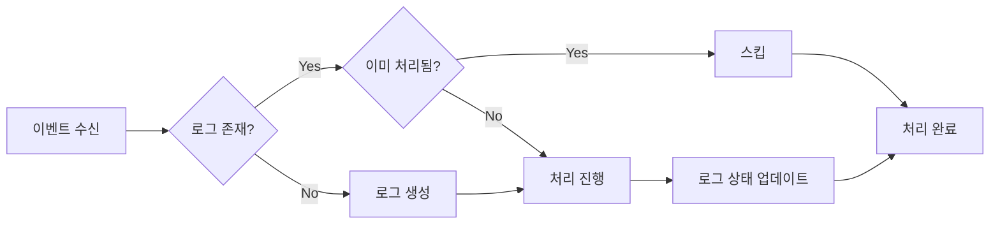
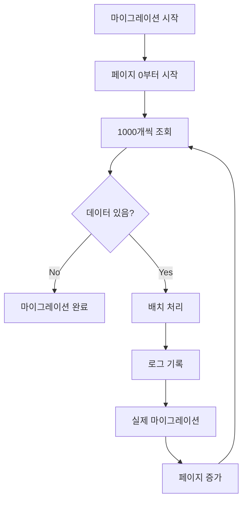

# 채팅방 병합 Saga 패턴 이벤트 흐름

## 전체 병합 프로세스 흐름

```mermaid
sequenceDiagram
    participant Client as 클라이언트
    participant Controller as RoomController
    participant Service as ChatRoomMergeService
    participant Producer as MergeEventProducer
    participant Kafka as Kafka Topic
    participant Consumer as MergeEventConsumer
    participant UserSvc as UserMigrationService
    participant MsgSvc as MessageMigrationService
    participant DB as MySQL/MongoDB

    Client->>Controller: POST /api/rooms/merge
    Controller->>Service: initiateMerge(mergeRequest)
    Service->>DB: MergeStatus 생성 (INITIATED)
    Service->>Producer: publishMergeInitiatedEvent()
    Producer->>Kafka: MERGE_INITIATED 이벤트 발행
    
    Note over Kafka: 이벤트 소비 시작
    Kafka->>Consumer: consumeMergeEvent(MERGE_INITIATED)
    Consumer->>Service: handleRoomsLocked()
    Service->>DB: 소스/타겟 방 상태를 MERGING으로 변경
    Service->>DB: MergeStatus 업데이트 (ROOMS_LOCKED)
    Service->>Producer: publishRoomsLockedEvent()
    Producer->>Kafka: ROOMS_LOCKED 이벤트 발행
    
    Kafka->>Consumer: consumeMergeEvent(ROOMS_LOCKED)
    Consumer->>Service: handleMessagesMigrate()
    Service->>MsgSvc: migrateMessages()
    MsgSvc->>DB: MessageMigrationLog 기록
    MsgSvc->>DB: MongoDB 메시지 roomId 업데이트
    Service->>DB: MergeStatus 업데이트 (MESSAGES_MIGRATED)
    Service->>Producer: publishMessagesMigratedEvent()
    Producer->>Kafka: MESSAGES_MIGRATED 이벤트 발행
    
    Kafka->>Consumer: consumeMergeEvent(MESSAGES_MIGRATED)
    Consumer->>Service: handleUsersMigrate()
    Service->>UserSvc: migrateUsers()
    UserSvc->>DB: UserMigrationLog 기록
    UserSvc->>DB: RoomUser 테이블 업데이트
    Service->>DB: MergeStatus 업데이트 (USERS_MIGRATED)
    Service->>Producer: publishUsersMigratedEvent()
    Producer->>Kafka: USERS_MIGRATED 이벤트 발행
    
    Kafka->>Consumer: consumeMergeEvent(USERS_MIGRATED)
    Consumer->>Service: handleMergeCompleted()
    Service->>DB: 소스 방을 ARCHIVED로 변경
    Service->>DB: MergeStatus 업데이트 (COMPLETED)
    Service->>Producer: publishMergeCompletedEvent()
    Producer->>Kafka: MERGE_COMPLETED 이벤트 발행
    
    Note over Service: 병합 완료!
```

## 롤백 처리 흐름

```mermaid
sequenceDiagram
    participant Service as ChatRoomMergeService
    participant UserSvc as UserMigrationService
    participant MsgSvc as MessageMigrationService
    participant DB as MySQL/MongoDB

    Note over Service: 병합 실패 시 롤백 시작
    
    alt USERS_MIGRATED 단계에서 실패
        Service->>Service: performRollback(USERS_MIGRATED)
        Service->>Service: rollbackUserMigration()
        Service->>DB: UserMigrationLog 페이징 조회
        loop 각 사용자별 롤백
            Service->>DB: wasMemberInTo 확인
            alt 새로 추가된 사용자
                Service->>DB: 타겟 방에서 사용자 제거
            else 기존 사용자
                Service->>DB: 역할을 이전 상태로 복원
            end
            alt 소스 방에 있었던 사용자
                Service->>DB: 소스 방에 사용자 복원
            end
            Service->>DB: UserMigrationLog를 ROLLED_BACK로 변경
        end
        Service->>Service: rollbackMessageMigration()
        Service->>DB: MessageMigrationLog 페이징 조회
        loop 각 메시지별 롤백
            Service->>DB: wasInTarget 확인
            alt 실제 이동된 메시지
                Service->>DB: roomId를 sourceRoomId로 되돌림
            end
            Service->>DB: MessageMigrationLog를 ROLLED_BACK로 변경
        end
        Service->>Service: unlockRooms()
        Service->>DB: 소스/타겟 방을 ACTIVE로 변경
    end
    
    alt MESSAGES_MIGRATED 단계에서 실패
        Service->>Service: performRollback(MESSAGES_MIGRATED)
        Service->>Service: rollbackMessageMigration()
        Service->>Service: unlockRooms()
    end
    
    alt ROOMS_LOCKED 단계에서 실패
        Service->>Service: performRollback(ROOMS_LOCKED)
        Service->>Service: unlockRooms()
    end
    
    Note over Service: 롤백 완료 - 시스템 상태 복원됨
```

## 이벤트 타입별 처리

```mermaid
flowchart TD
    A[MERGE_INITIATED] --> B[방 잠금 처리]
    B --> C[ROOMS_LOCKED]
    C --> D[메시지 마이그레이션]
    D --> E[MESSAGES_MIGRATED]
    E --> F[사용자 마이그레이션]
    F --> G[USERS_MIGRATED]
    G --> H[병합 완료]
    H --> I[MERGE_COMPLETED]
    
    B --> J[실패 시 롤백]
    D --> K[실패 시 롤백]
    F --> L[실패 시 롤백]
    
    J --> M[방 잠금 해제]
    K --> N[메시지 롤백]
    N --> M
    L --> O[사용자 롤백]
    O --> N
    M --> P[시스템 복원 완료]
```

## 데이터베이스 상태 변화

```mermaid
stateDiagram-v2
    [*] --> ACTIVE: 방 생성
    ACTIVE --> MERGING: 병합 시작
    MERGING --> ACTIVE: 롤백 시
    MERGING --> ARCHIVED: 병합 완료 (소스 방)
    ACTIVE --> ARCHIVED: 병합 완료 (소스 방)
    
    note right of MERGING
        병합 중인 상태
        - 메시지 이동 불가
        - 사용자 이동 불가
        - 롤백 가능
    end note
    
    note right of ARCHIVED
        병합 완료된 소스 방
        - 읽기 전용
        - 복구 불가
    end note
```

## 멱등성 보장 메커니즘

```mermaid
flowchart LR
    A[이벤트 수신] --> B{로그 존재?}
    B -->|Yes| C{이미 처리됨?}
    B -->|No| D[로그 생성]
    C -->|Yes| E[스킵]
    C -->|No| F[처리 진행]
    D --> F
    F --> G[로그 상태 업데이트]
    E --> H[처리 완료]
    G --> H
```

## 페이징 처리 흐름

```mermaid
flowchart TD
    A[마이그레이션 시작] --> B[페이지 0부터 시작]
    B --> C[1000개씩 조회]
    C --> D{데이터 있음?}
    D -->|No| E[마이그레이션 완료]
    D -->|Yes| F[배치 처리]
    F --> G[로그 기록]
    G --> H[실제 마이그레이션]
    H --> I[페이지 증가]
    I --> C
```
