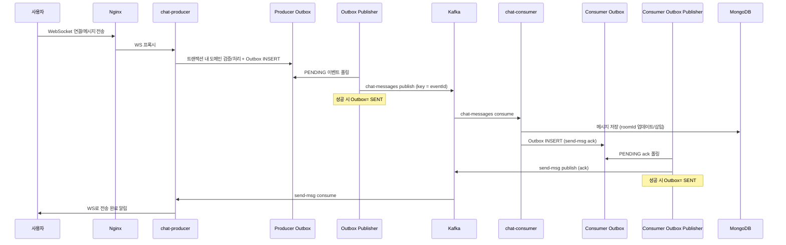
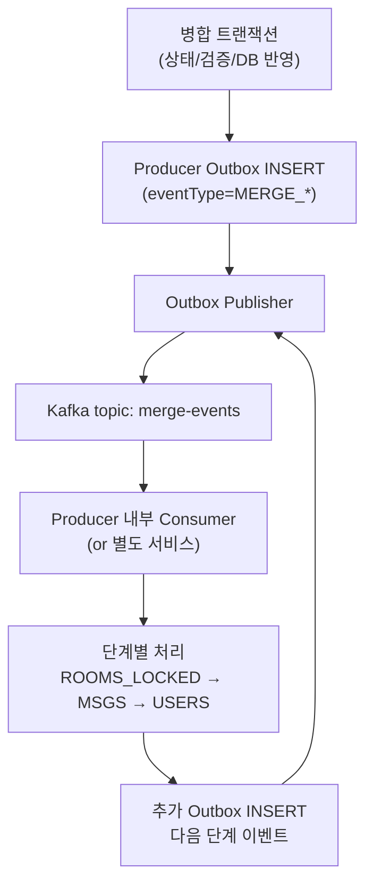
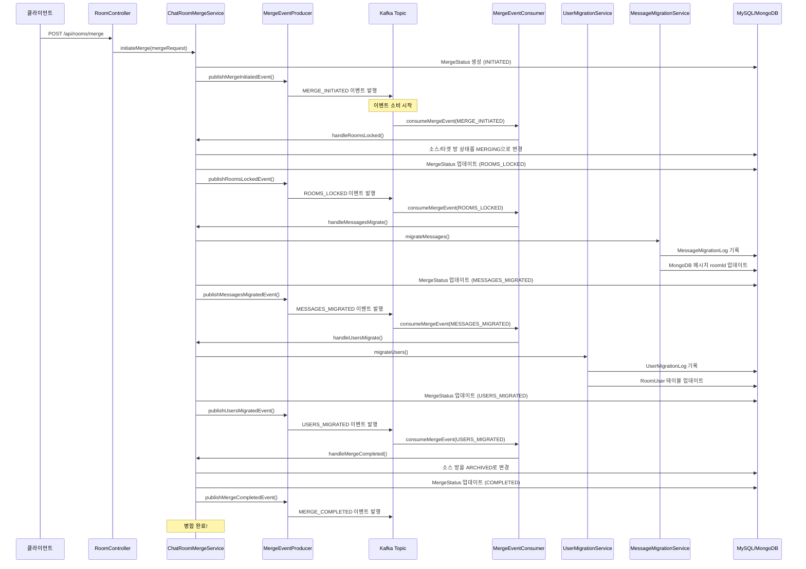
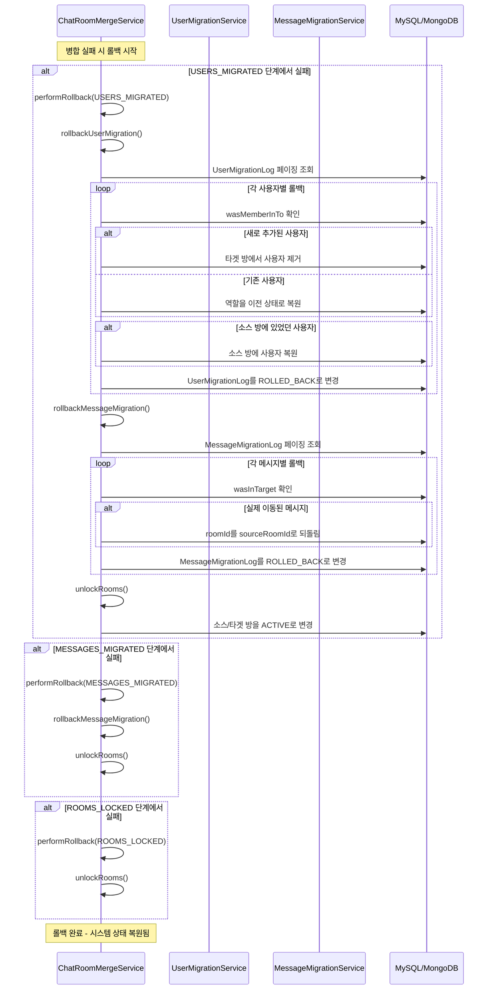
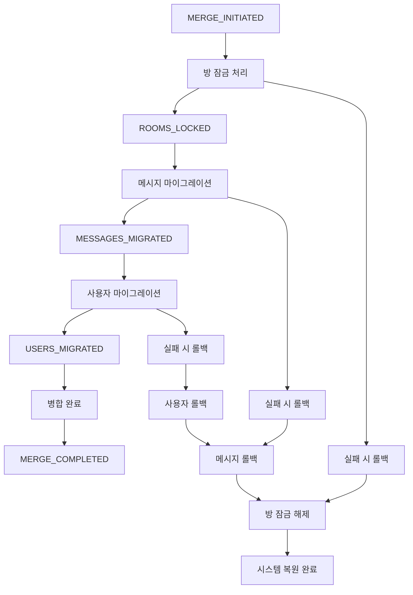
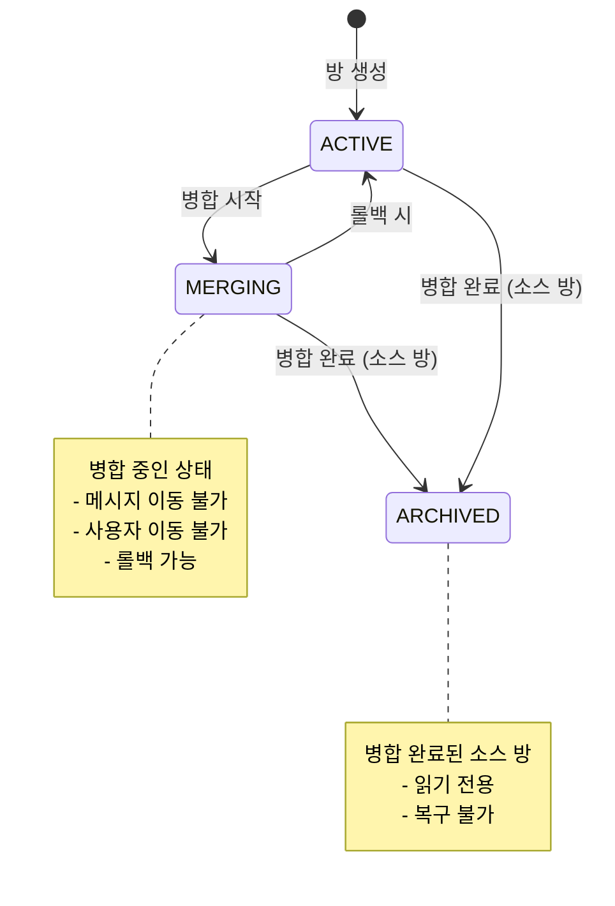
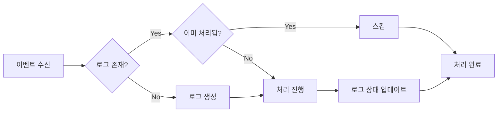
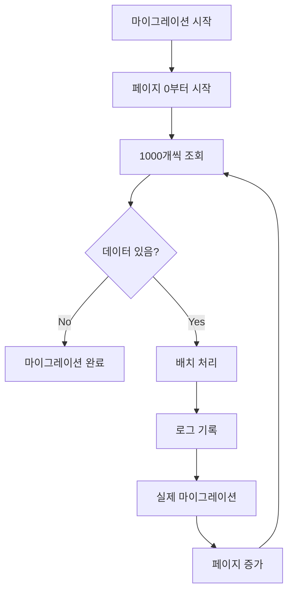
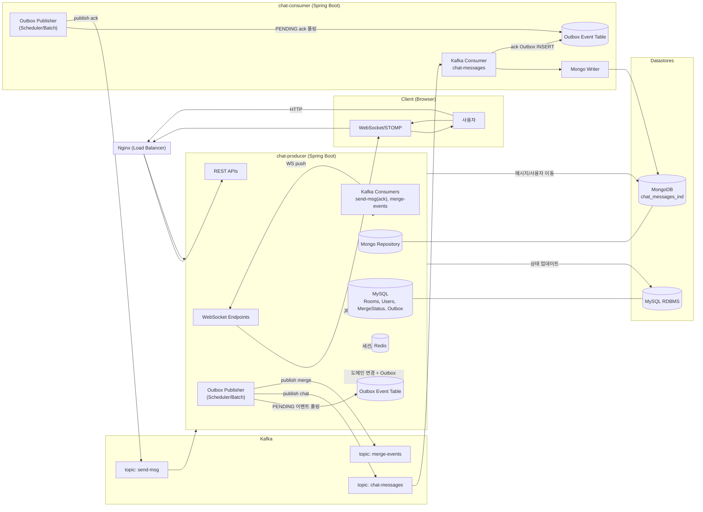

# 프로젝트 아키텍처 개요

## 채팅 메시지 플로우 (Outbox 기반 시퀀스)

## 병합 이벤트 플로우

## Outbox 설계 메모
- Outbox 키: `eventId(UUID)`를 Kafka key로 사용해 멱등 보장
- 컬럼 예시: id, aggregateType, aggregateId, eventType, payload(JSON), status(PENDING|SENT|FAILED), createdAt, sentAt, version
- 퍼블리셔: 페이지네이션(예: 1000개) + 백오프 재시도
- 트랜잭션 경계: 도메인 변경과 Outbox INSERT는 동일 트랜잭션
- Consumer 측 ack 또한 Outbox로 구성(선택)하여 재시도/멱등 강화 

 
 

# 채팅방 병합 Saga 패턴 이벤트 흐름

## 전체 병합 프로세스 흐름

## 롤백 처리 흐름

## 이벤트 타입별 처리

## 데이터베이스 상태 변화

## 멱등성 보장 메커니즘

## 페이징 처리 흐름

 
 

# 전체 서비스 토폴로지

